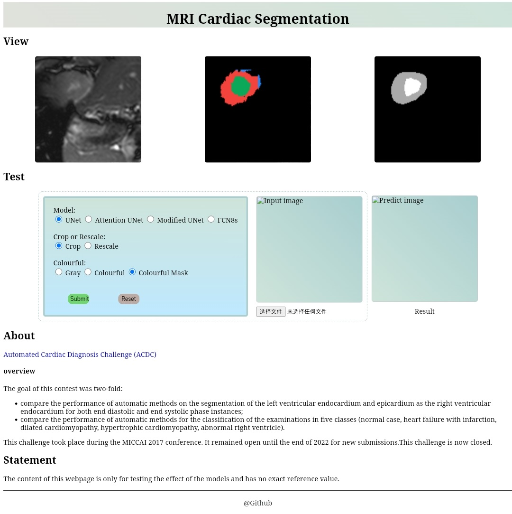

# ACDC segmenter

### Data source

you can learn about and download the dataset from [ACDC 2017](https://www.creatis.insa-lyon.fr/Challenge/acdc/index.html)

你可以从上述链接中了解和下载ACDC 2017数据集。

### About the Project

这是一个分割任务项目

在这个项目中还包含了一个使用网页设计的分割系统，使用Flask框架。其位于 `webProject` 中。

你可以利用 `Configuration.md` 文件中的描述来配置环境并运行这个项目。

it's a segmentation project. (no classification work)

the project include a web subproject.

### webProject

it use Flask

web page:

### Thanks

i get many helps from:
[acdc wangtao2001](https://github.com/wangtao2001/acdc)
and
[acdc\_segenmter baumgach](https://github.com/baumgach/acdc_segmenter)

i appreciate them.

